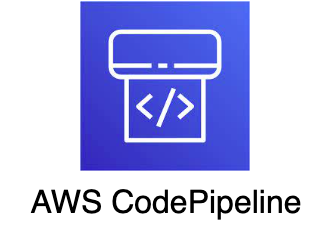
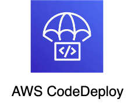
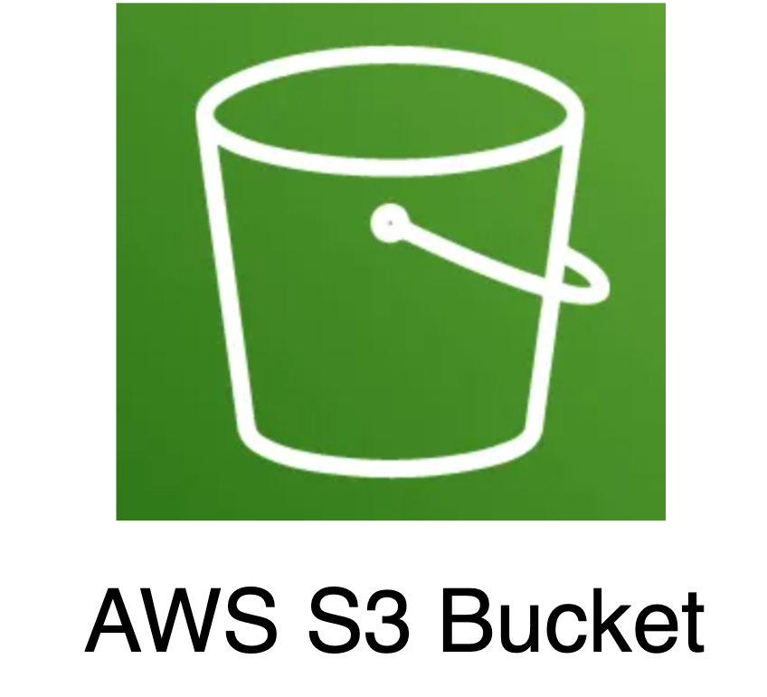
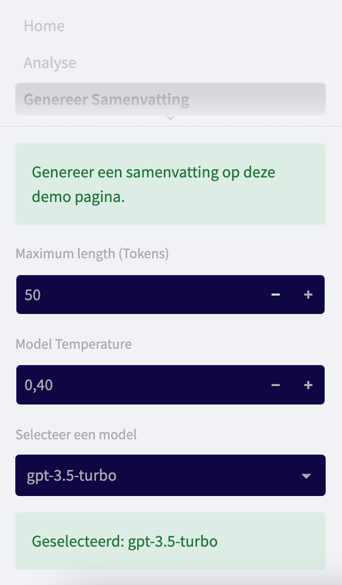
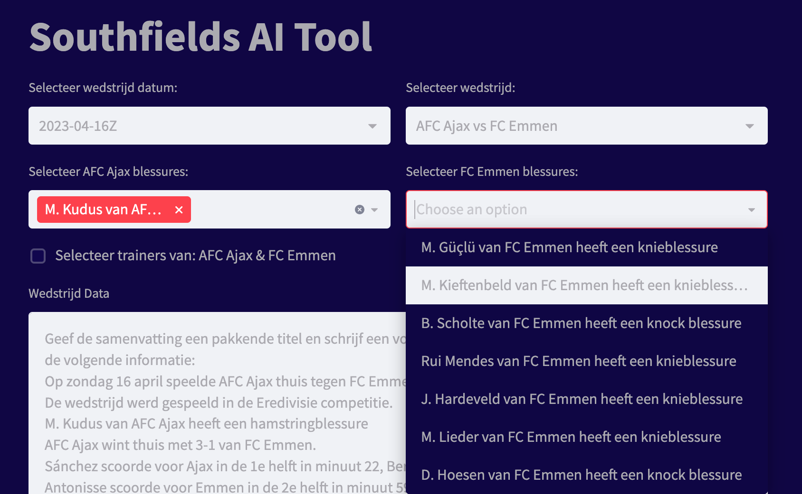
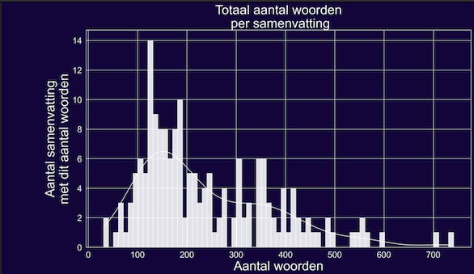
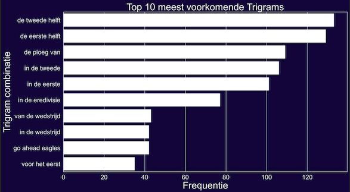

<meta http-equiv='cache-control' content='no-cache'> 
<meta http-equiv='expires' content='0'> 
<meta http-equiv='pragma' content='no-cache'>

# Introductie 
*Author: Marc Blomvliet - Aurai*  
Dit project is gestart als MVP voor Southfields (Project GPT3 - GPT3.5).
Het doel van het project is om middels van play by play data, afkomstig van OPTA, voetbal wedstrijdsamenvattingen te genereren met een Language model.

## Bouwstenen
Om een beter beeld te krijgen hoe de GIT Repository is opgebouwd, verdeel ik het in hoofdzakelijk 4 componenten.  
- ESPN Scraper om Wedstrijd samenvattingen te vergaren */espn_scraper*
- OPTA Data (API) - Data to prompt Pipeline */opta*
- Streamlit Web Application */pages* + */.streamlit* + File *Home.py*
- OpenAI GPT3 Trainings Pipeline */openai_GPT3* om een GPT model te finetunen op ESPN samenvattingen/data

Om een gefinetuned model voor zowel Curie als Davinci te realiseren waren de ESPN wedstrijdsamenvattingen (web scraped) van essentieel belang. Aangezien er twee 'Main components' nodig zijn om een eigen model te trainen:  
1. Play by Play data (OPTA) als input (Prompt), dit wordt gebruikt als input voor het model om te kunnen begrijpen wat het nodig heeft om een wedstrijdsamenvatting te kunnen schrijven.   
2. Historische wedstrijdsamenvattingen (Completion), dit wordt gebruikt zodat het model begrijpt wat het ongeveer moet gaan genereren/schrijven aan de hand van de Input data.  

Er is een pipeline gebouwd om alle benodigde/gewenste data uit OPTA op te halen en uiteindelijk te engineeren tot een **perfecte** Prompt (Input voor het ML model).  
*Belangrijk is om een natuurlijk geschreven prompt aan te leveren aan het model, om een zo goed mogelijke completion(resultaat) terug te krijgen.*  
Met een "natuurlijk geschreven prompt" wordt bedoeld, dat de ruwe data moet worden vertaald naar "natural language". Dit is gerealiseerd door middel van een pipeline script (geschreven in Python).  
Een voorbeeld hiervan is:  
> prompt ruwe data (Foutief): {helft=1, minuut=3, type=G, speler=Córdoba}  
> prompt natural language (Goed): {Córdoba scoorde voor Fortuna Sittard in de 1e helft in minuut 3}  

Ten derde is er een Trainings pipeline gebouwd, dit is het process wat na de OPTA pipeline komt. Dus zodra alle OPTA data opgehaald, geprocessed en weggeschreven is naar een *.csv* file.  
De trainings pipeline creëert het juiste format wat gewenst is vanuit OpenAI, enkel twee columns/keys: prompt en completion.
De trainings pipeline engineert alle OPTA data wat is opgehaald tot een vlot en begrijpbaar verhaal. En daarnaast zorgt het er ook voor dat alle events in de juiste tijdlijn achter elkaar staan, wat uiteindelijk weer de kans verhoogd voor een goed lopend en een correcte wedstrijdsamenvatting.  

Om iedereen te laten testen met het Language model met diverse wedstrijden, is er een applicatie gebouwd in Streamlit. De applicatie bestaat uit 3 pagina's.

**De volgende hoofdstukken zullen dieper ingaan op deze bouwstenen van de Git Repository.  Maar eerst volgt er een toelichting over de gebruikte Cloud Resources in AWS.**

# AWS - Cloud resources
Voor dit project zijn een aantal resources gebruikt in AWS, om de applicatie te kunnen gebruiken in productie.  

## EC2 Instance 

De datasets (*.csv* files in de S3 Bucket: **gpt-ai-tool-wsc**) voor de eredivisie en KKD (tot nu toe), worden geüpdated door de EC2 instance.  
Voor nu gebeurt dit handmatig, en kan dit gedaan worden indien er nieuwe wedstrijden zijn geweest.  

De EC2 maakt gebruik van een elastic IP, indien de EC2 wordt gestopt op wat voor een reden dan ook dan behoudt de compute zijn IP address (3.78.91.250).  
Indien de EC2 is gestopt door iemand, dan dient de volgende service opnieuw te worden gestart:  
> sudo systemctl start nginx.service  
 

**Hoe update ik de datasets?**  
Gebruik SSH om de EC2 instance te beheren, zorg ervoor dat je dit command uitvoert in dezelfde folder waar de <o>GPT3-AI-tool.pem</o> staat:
> sudo ssh -i <o>GPT3-AI-tool.pem</o> ec2-user@ec2-3-78-91-250.eu-central-1.compute.amazonaws.com  

De *.pem* file heb je nodig om de EC2 in te kunnen. (Vraag Steven of Mitchell van Southfields om deze file)   
Wanneer je binnen bent in de EC2, zit je zeer waarschijnlijk in de folder *ec2-user*. 
Ga een folder terug door middel van het volgende commands:  
> cd ..  
> ls  

Als het goed is zie je nu: 
<b>app ec2-user</b>  

Ga naar de folder app:
> cd app  

Nu kan je de datasets updaten door middel van het volgende command:  
> sudo ./AWS_scripts/dataset_pipeline/eredivisie.sh  
> sudo ./AWS_scripts/dataset_pipeline/KKD.sh  

**Herstarten van de applicatie.**  
Indien het script klaar is met runnen, dien je de streamlit applicatie opnieuw op te starten. Zodat de nieuwe datasets worden ingeladen in de Streamlit applicatie. Dit kan vanuit elke folder:  
> sudo systemctl restart streamlit.service  

Of:

> sudo systemctl stop streamlit.service  
> sudo systemctl start streamlit.service  

Extra:  
Status van de service kan je inzien door middel van:  
> journalctl -u streamlit.service -n 40
## Code Pipeline + Code Deploy
AWS CodePipeline wordt gebruikt om continous delivery pipelines te automatiseren voor snelle en betrouwbare updates op de *main* branch van de Git-repository. Dus telkens wanneer een nieuwe push is doorgevoerd naar de *main* branch, wordt de pipeline geactiveerd en daarom worden de bestanden op de EC2-instantie bijgewerkt, met behulp van CodeDeploy.  
AWS CodeDeploy is een volledig beheerde deployment service, die de software deployments automatiseert op de EC2 instance i.c.m. CodePipeline.

## Route 53
AWS Route53 is een DNS webservice en verbindt gebruikers met de web applicatie die op de EC2 instance draait.  
Gebruikers worden dus veilig geroute naar de web applicatie [dashboard.sportnatives.com](http://dashboard.sportnatives.com/) (Die als service op de EC2 draait). 

## S3 bucket
AWS S3 (bucket naam: **gpt-ai-tool-wsc**) wordt gebruikt om files op te slaan, zoals de datasets die in format *.csv* zijn.
Ook de video's die afkomstig zijn van WSC worden opgeslagen in een S3 bucket (bucket naam: **wsc-espn-site**).

## Secrets Manager
AWS Secrets Manager wordt gebruikt voor de volgende zaken die privé moeten blijven, en niet openbaar gemaakt mogen worden:  
- Gebruikersnamen (*Streamlit*)
- Wachtwoorden (*Streamlit*)
- API Key (*OpenAI*)
- API authorisatie Keys (*OPTA*)

# ESPN Website Scraper 
De wedstrijd samenvattingen van ESPN staan niet in een grijpbare Database van bijvoorbeeld een cloudprovider zoals: AWS, Azure of GCloud. Daarom is er een webscraper gebouwd om alle Eredivisie en Keuken kampioen divisie wedstrijdsamenvattingen op te halen.  
De scraper is te vinden in folder: *./espn_scraper*, in te vinden in de Repository branch **ESPN_scraper**.

# OPTA (API) - Data to Prompt Pipeline
De Pipeline is opgebouwd in File: *soccer_pipeline.py*. Het idee is dat deze Pipeline wordt getriggerd op bepaalde momenten zoals:  
- Eens per dag  
- Manuele Trigger door een redactielid  
- Zodra een wedstrijd is afgelopen (Meer geavanceerd)  

Dit proces zou in de toekomst in een Cloud job scheduler kunnen worden geimplementeerd om geautomatiseerd data transformatie workflows uit te voeren.  

De pipeline is opgebouwd als volgt:  

Zoals je ziet heeft de Pipeline 2 Parameters nodig om te starten *competitie ID* en de bijbehorende *authorisatie key(OPTA)* die bij deze competitie hoort.  
Dit betekent dat de pipeline inprincipe universeel werkt voor elke voetbal competitie. Zolang OPTA dezelfde structuur behoud voor elke voetbal competitie.  
De volgende lijst geeft weer wat voor <b>functies</b> er gebruikt worden in de pipeline, en indien het in de vorm van een dictionary is wat voor <o>keys</o> er bestaan per kolom.  
De pipeline zet alles in een *pandas dataframe*.  
De eerste stap in de pipeline is:  
**<b>get_tournamentschedule()</b>** - <g>utils/opta_feeds.py</g> - Deze functie vergaart het volgende:
- id (Wedstrijd ID's)
- date (Datum)
- homeContestantId (Thuisploeg ID)
- awayContestantId (Uitploeg ID)
- homeContestantOfficialName (Thuisploegnaam)
- awayContestantOfficialName (Uitploegnaam)

**<b>get_cup()</b>** - <g>utils/opta_feeds.py</g> - Deze functie vergaart het volgende:
- cup (Naam van de competitie als *string*)

**<b>get_matchLength()</b>** - <g>utils/opta_feeds.py</g> - Deze functie vergaart het volgende:
- matchLength (De duur van de wedstrijd in minuten)

**<b>get_score()</b>** - <g>utils/opta_feeds.py</g> - Deze functie vergaart het volgende:
- score_home (Doelsaldo thuisploeg)
- score_away (Doelsaldo uitploeg)

**<b>get_matchstats_possession()</b>** - <g>utils/opta_feeds.py</g> - Deze functie vergaart het volgende:
- possession_home (Balbezit thuisploeg, uitgedrukt in %)
- possession_away (Balbezit uitploeg, uitgedrukt in %)

**<b>get_matchstats_cards()</b>** - <g>utils/opta_feeds.py</g> - Deze functie vergaart het volgende:
- card_events (Als *dictionary*)
    - <o>contestantName</o> (Team naam)
    - <o>contestantId</o> (ID van team)
    - <o>periodId</o> (Helft nummer -> 1 of 2)
    - <o>timeMin</o> (In welke minuut het event heeft plaats gevonden)
    - <o>playerId</o> (ID van speler)
    - <o>playerName</o> (Spelers naam)
    - <o>cardType</o> (Kaart type die de speler heeft gekregen -> geel, tweede geel of rood)
    - <o>cardReason</o> (De reden van de kaart)

**<b>get_venue()</b>** - <g>utils/opta_feeds.py</g> - Deze functie vergaart het volgende:
- venue: Vergaar de naam van het stadion waar de wedstrijd plaats vond.

**<b>get_matchstats_goals()</b>** - <g>utils/opta_feeds.py</g> - Deze functie vergaart het volgende:
- goal_events (Als *dictionary*)
    - <o>contestantName</o> (Team naam)
    - <o>contestantId</o> (ID van team)
    - <o>periodId</o> (Helft nummer -> 1 of 2)
    - <o>timeMin</o> (In welke minuut het event heeft plaats gevonden)
    - <o>scorerId</o> (ID van speler die heeft gescoord)
    - <o>scorerName</o> (Spelers naam van de gene die het doelpunt maakte)
    - <o>goalType</o> (The type of the goal - one of the following: G (goal) | OG (own goal) | PG (penalty goal))
    - <o>assistName</o> (Indien aanwezeg: Spelersnaam van de gene die de assist gaf)
- goalMakers (Lijst met namen, van de spelers die een goal hebben gemaakt deze wedstrijd)

**<b>get_trainer()</b>** - <g>utils/opta_feeds.py</g> - Deze functie vergaart het volgende:
- trainer_home (De naam van de trainer, thuisploeg)
- trainer_away (De naam van de trainer, uitploeg)
 
**<b>get_keepers()</b>** - <g>utils/opta_feeds.py</g> - Deze functie vergaart het volgende:
- keeper_home (De naam van de keeper, thuisploeg)
- keeper_away (De naam van de keeper, uitploeg)

**<b>get_injuries()</b>** - <g>utils/opta_feeds.py</g> - Deze functie vergaart het volgende:
- home_injuries (Lijst van de lopende blessures van de thuisploeg)
    - <o>Spelersnaam</o>
    - <o>Type blessure</o>
- away_injuries (Lijst van de lopende blessures van de uitploeg)
    - <o>Spelersnaam</o>
    - <o>Type blessure</o>

**<b>get_rankStatus()</b>** - <g>utils/opta_feeds.py</g> - Deze functie vergaart het volgende:
- rank_home (Uitgedrukt in een getal, dat de plaats in de ranglijst van de competitie aanduidt)
- rank_away (Uitgedrukt in een getal, dat de plaats in de ranglijst van de competitie aanduidt)
- last_six_home (Uitslag reeks laatste 6 wedstrijden: W=Gewonnen, D=Gelijk, L=Verloren)
- last_six_away (Uitslag reeks laatste 6 wedstrijden: W=Gewonnen, D=Gelijk, L=Verloren)
- rank_status_home: Geeft aan of de ploeg op degradatie staat, champions league, etc..
- rank_status_away: Geeft aan of de ploeg op degradatie staat, champions league, etc..
- lastRank_home: De rank van de thuisploeg vóór de wedstrijd
- lastRank_away: De rank van de uitploeg vóór de wedstrijd

**<b>get_formations()</b>** - <g>utils/opstelling.py</g> - Deze functie vergaart het volgende:
- formation_home (De opstelling van de thuisploeg)
    - Spelersnaam
    - Positie
    - Positie kant
    - Speler informatie/Statistieken
        - <o>minsPlayed</o> (Minuten gepspeeld in de huidige wedstrijd)
        - <o>totalPass</o> (Aantal passes in de wedstrijd van de speler)
        - <o>accuratePass</o> (Accuracy van de aangekomen passes, uitgedrukt in percentage)
        - <o>goalAssist</o> (Identificeert of een speler een assist heeft gemaakt tijdens de wedstrijd, uitgedrukt in aantal/getal)
        - <o>totalScoringAtt</o> (Identificeert het aantal doelpunt pogingen van een speler, gedurende de wedstrijd. Uitgedrukt in aantal/getal)
        - <o>saves</o> (Beschikbaar voor de keepers, geeft aan hoeveel 'saves' een keeper heeft gemaakt tijdens de wedstrijd. Uitgedrukt in aantal/getal)
- formation_away
- player_stats_home
- player_stats_away

**<b>get_substitute()</b>** - <g>utils/opstelling.py</g> - Deze functie vergaart het volgende:
- substitutions_home
    - player_off_name / player_on_name (De spelers naam die er af gaat, of de spelers naam van de speler die in het spel komt)
    - playerOnId (ID van de speler die in het spel komt)
    - playerOffId (ID van de speler die uit het spel gaat)
    - timeMin (Identificeert in hoeveelste minuut de wissel heeft plaats gevonden)
    - minsPlayed (Hoeveel minuten de speler die er in komt heeft gespeeld)
    - subReason (De reden van de wissel)
- substitutions_away
    - player_off_name / player_on_name (De spelers naam die er af gaat, of de spelers naam van de speler die in het spel komt)
    - playerOnId (ID van de speler die in het spel komt)
    - playerOffId (ID van de speler die uit het spel gaat)
    - timeMin (Identificeert in hoeveelste minuut de wissel heeft plaats gevonden)
    - minsPlayed (Hoeveel minuten de speler die er in komt heeft gespeeld)
    - subReason (De reden van de wissel)
**<b>get_totalCardsPlayer()</b>** - <g>utils/playerStats.py</g> - Deze functie vergaart het volgende:
- cardsHistoryRed (Een dictionary van spelersnamen die tijdens de wedstrijd een rode kaart hebben gekregen, en een getal die bijhoudt hoeveel rode kaarten de speler al in dit seizoen in totaal heeft gekregen)
- cardsHistoryYellow (Een dictionary van spelersnamen die tijdens de wedstrijd een gele kaart hebben gekregen, en een getal die bijhoudt hoeveel gele kaarten de speler al in dit seizoen in totaal heeft gekregen)

**<b>get_matchStats()</b>** - <g>utils/playerStats.py</g> - Deze functie vergaart het volgende:
- SchotenOpDoel_Home (Een getal dat aangeeft hoeveel schoten op doel het Thuis team in totaal heeft gemaakt)
- SchotenOpDoel_Away (Een getal dat aangeeft hoeveel schoten op doel het Uit team in totaal heeft gemaakt)
- penaltyHome
    - playerName (Spelersnaam van de keeper)
    - playerId (ID Van de speler/keeper)
    - penaltyFaced (Geeft aan dat de keeper een penalty tegen had)
    - penaltySave (Enkel aanwezig als de keeper de penalty heeft tegen gehouden)
- penaltyAway
    - playerName (Spelersnaam van de keeper)
    - playerId (ID Van de speler/keeper)
    - penaltyFaced (Geeft aan dat de keeper een penalty tegen had)
    - penaltySave (Enkel aanwezig als de keeper de penalty heeft tegen gehouden)
- MatchStatsHome (Statistieken van de Thuisploeg spelers)
    - SchotenOpDoel (Aantal schoten op doel tijdens de wedstrijd, in totaal)
    - playerName (Spelersnaam )
    - playerId (ID Van de speler)
- MatchStatsAway (Statistieken van de Uitploeg spelers)
    - SchotenOpDoel (Aantal schoten op doel tijdens de wedstrijd, in totaal)
    - playerName (Spelersnaam )
    - playerId (ID Van de speler)

**<b>get_countPlayerGoals()</b>** - <g>utils/playerStats.py</g> - Deze functie vergaart het volgende:
- GoalCounter (Een dictionary van spelers die tijdens de wedstrijd hebben gescoord inclusief clubnaam, en een getal wat het totaal aantal goals aanduidt gedurende het hele seizoen van de speler)
- AssistCounter (Een dictionary van spelers die tijdens de wedstrijd een assist hebben gemaakt inclusief clubnaam, en een getal wat het totaal aantal assists aanduidt gedurende het hele seizoen van de speler)

**<b>get_totalMinsPlayed_Season_Player()</b>** - <g>utils/playerStats.py</g> - Deze functie vergaart het volgende:
- minsPlayedCounter (Een dictionary van alle spelers die hebben gespeeld tijden de wedstrijd, met een totaal aantal gespeelde minuten van die speler van het gehele seizoen. Waarbij de geselecteerde wedstrijd al is inbegrepen)

**<b>get_totalMinsPlayed_Season_Team()</b>** - <g>utils/playerStats.py</g> - Deze functie vergaart het volgende:
- sum_matchLength_home (Identificeert het totaal aantal gespeelde minuten van het thuis team dit seizoen)
- sum_matchLength_away (Identificeert het totaal aantal gespeelde minuten van het uit team dit seizoen)

**<b>prompt_engineering()</b>** - <g>utils/soccer_prompt.py</g> - Deze functie vergaart het volgende:
- Deze functie doet een paar laatste transformaties op de dataset.

**Om de pipeline succesvol uit te voeren, is er een .env file nodig onder folder */opta* met de OPTA authorisatie key voor de bijbehorende competitie.**

In het onderstaande voorbeeld zie je hoe een authorisatie key wordt opgehaald uit de environment file (*.env*) om een API call naar OPTA succesvol te kunnnen uitvoeren.  
Voorbeeld authorisatie key:  
*outletAuthKey_ereD = os.getenv("outletAuthKey_ereD")*

# Streamlit Application
**Introductie Streamlit:**  
Voor dit project heb ik gebruik gemaakt van Streamlit, een open-source Python library. 
Het is erg gebruiksvriendelijk voor zowel de user als de developer. Het is fijn in gebruik om snel een 'fancy' maar met name 'praktische' custom  web applicatie mee te bouwen. Zelf vind ik het erg fijn om te gebruiken voor machine learning demos/toepassingen.

Test Streamlit lokaal, vanuit de root folder:
> streamlit run Home.py

Ga naar: http://localhost:8501 of http://localhost:8502

## Constructie
Om iedereen te laten testen met het Language model met diverse wedstrijden, is er een applicatie gebouwd in Streamlit. De applicatie is opgebouwd met het Streamlit multipage principe. Bestaande uit 3 pagina's:  
1. **Home page**: Introductie pagina van de Web App.  
2. **Genereer Samenvatting page**: Hier kan men met diverse wedstrijden testen en zelf diverse prompts creëren door middel van de fijne User Interface.  
    ***2a.*** Voetbal 
    ***2b.*** Voetbal Stats 
    ***2c.*** Voetbal Videos 
3. **Analyse Page**: Hier zijn diverse insights te vinden over de data die is gebruikt (Eredivisie).  

### Home - Page
De home pagina is puur ter introductie van de Applicatie, niets meer en minder.
### Genereer samenvatting - Page 
Deze pagina is beveiligd door middel van een gebruikersnaam en wachtwoord.  
De reden hiervoor is dat onbevoegde mensen dan niet zomaar gebruik kunnen maken van de OpenAI API key van Southfields. Dit voorkomt random kosten/verbuik in API calls.  
#### Voetbal - Tabpage

##### Parameters 
Nadat je succesvol bent geautoriseerd heb je toegang tot de officiele 'genereer samenvatting page'.  
Op deze pagina is het mogelijk om in de **sidebar** het model te selecteren (*gpt-3.5-turbo geadviseerd*). Daarnaast is het mogelijk om twee model parameters te veranderen:  
- **Maximum Tokens**: Maximum of characters/tokens in the output (1000 tokens is about 750 words) 
- **Model Temperature**: Creation of randomness (Higher value) or make the model more focused (Lower value). 

In het 'hoofd gedeelte' van de pagina kan je een selectie doen op:  
- Wedstrijd datum  
- Wedstrijd die op de geselecteerde datum heeft plaats gevonden  

Meenemen in de prompt ja/nee: 
- De blessures van het **thuis** team (Op basis van de twee bovenstaande geselecteerde velden)  
- De blessures van het **uit** team (Op basis van de twee bovenstaande geselecteerde velden)  
- De trainersnamen  

##### Genereer een samenvatting
Het textveld veranderd interactief, door de handelingen van de user. Zo wordt er dus voor elke wedstrijd een unieke prompt gecreëerd in het textveld onder 'Wedstrijd data'.  
In de background wordt alle OPTA data van de geselecteerde wedstrijd opgehaald en geprocessed in een 'natural language' format, dit process wordt ook wel een pipeline genoemd.  
Het is zelfs ook nog mogelijk om in het textveld handmatig extra data/text mee te geven als input voor het model.  
Zodra de user de gewenste prompt voor zich heeft, hoeft de user enkel de '**Genereer**' button te activeren.  

#### Voetbal Stats - Tabpage
In deze tab van de hoofd page: *Genereer Samenvatting*, kun je diverse statistieken inzien. Op speler en team niveau, en daarnaast zijn sommige stastieken gebaseerd op de wedstrijd maar sommige weer seizoens gebonden.
#### Voetbal Videos - Tabpage
In deze tab van de hoofd page: *Genereer Samenvatting*, kun je videos zien van Goal events op de geselecteerde datum.

### Analyse - Page
Op deze pagina is het mogelijk om analyse uit te voeren door middel van interactieve plots.  
Voor nu is het enkel gebaseerd op Eredivisie data, en is het puur ter illustratie en geneert het interessante user insights.  

# OpenAI GPT3 - Trainings Pipeline 

# Toekomst perspectief
- Datasets ipv *.csv* in een S3 bucket, migreren naar bijvoorbeeld een RDS Database.
- Datasets (üpdaten), triggeren op basis van een schedule ipv handmatig.
